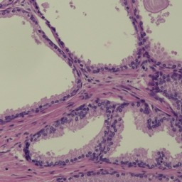
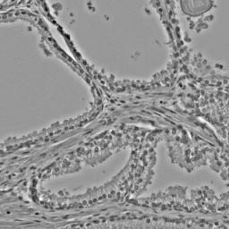
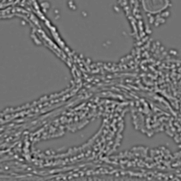
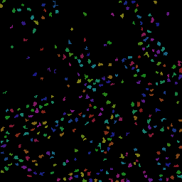

talk - Segmentation of 2D images
==================================

Talk is a command line utility to compute regions of interest in a 2D image. It is useful if many small
objects can be detected by a size range and an aspect ratio. As an output the list of found objects is
printed.

You can download a compiled version of the program, or build from the source code using golang.

* Linux
   wget https://github.com/HaukeBartsch/talk/raw/master/talk (MacOS)

</img>
</img>
</img>
</img>

Help:

```
NAME:
   talk - 2D image segmentation

   Program to describe an image of many small objects. Each object is filtered by
   size and aspect ratio. Objects that fulfill the criteria of the filter are printed
   on standard-out as well highlighted in an output image.

USAGE:
   talk [global options] command [command options] [arguments...]

VERSION:
   0.0.1

AUTHOR:
  Hauke Bartsch - <HaukeBartsch@gmail.com>

COMMANDS:
   segment1, s1	Detect dark regions in input image with:
		      ./talk segment1 tqsrrrqt.jpg 10 28 3
   help, h	Shows a list of commands or help for one command
   
GLOBAL OPTIONS:
   --verbose		Generate verbose output with intermediate files.
   --help, -h		show help
   --version, -v	print the version
```

Example usage:

The segment1 command will normalize the image and sharpen it using a mexican hat filter. Region growing is executed at different threshold levels and for each threshold value a region growing will extract objects that are filtered by min/max size and aspect ratio.

```
./talk segment1 --help
NAME:
   segment1 - Detect dark regions in input image with:
         ./talk segment1 tqsrrrqt.jpg 10 28 3

USAGE:
   command segment1 [command options] [arguments...]

DESCRIPTION:
   Compute a label field, save it as a color image and a list all found segments on stdout.

   This command requires four arguments, the file name, minimum number of pixel of valid
   objects, maximum number of pixel of valid objects and the maximum aspect ratio allowed
   for a valid object. If the aspect ratio is negative it specifies the minimum allowed
   aspect ratio.

OPTIONS:
   --meansize "13"	Size of the region from which the local mean intensity is calculated
   --focussize "1.8"	Size in pixel that we focus on, structures larger and smaller are blurred
   --notinvert 		Do not invert the image (default is to invert, detect dark objects)
```

In order to run segment1 for an input image do:

```
./talk --verbose segment1 tqsrrrqt.jpg 10 28 3
>  verbose on
>  run segment1
>  image size is 256 by 256 pixel
>  min/max: 6477.453700 49578.101300
>  mean size used: 13
>  write out mean removed image tqsrrrqt_001_meanoff.png
>  invert the image before segmentation
>  focus size used: 1.8
>  write out the focused and inverted image tqsrrrqt_002_focus.png
>  segment1 with size thresholds 10 .. 28, and max aspect ratio of 3
i: 0, x: 127, y: 253, s: 22, a: 1.1053
i: 1, x: 154, y: 91, s: 18, a: 1.2857
i: 2, x: 80, y: 16, s: 21, a: 1.1154
i: 3, x: 137, y: 113, s: 26, a: 1.7694
...
i: 327, x: 54, y: 187, s: 11, a: 1.6154
i: 328, x: 226, y: 140, s: 20, a: 2.8534
i: 329, x: 98, y: 90, s: 12, a: 2.6567
>  write out the found segmentation tqsrrrqt_seg.png
```